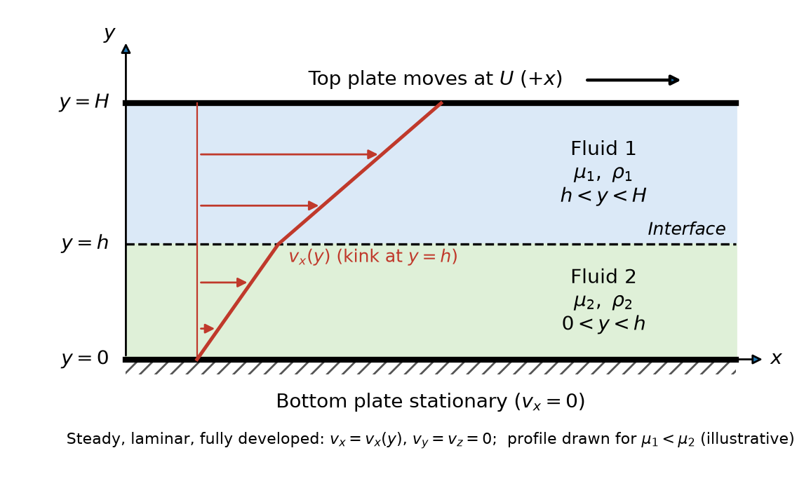

**Question**

Two immiscible Newtonian fluids, fluid 1 and fluid 2, are confined between two infinite, parallel plates separated by a distance $H$. The fluid interface lies at $y = h$. The bottom plate at $y = 0$ is stationary, while the top plate at $y = H$ moves in the $x$-direction with constant velocity $U$. Flow is steady, laminar, and fully developed, with $v_x = v_x(y)$ and $v_y = v_z = 0$.

(a) Draw the schematic of the problem

(b) What boundary conditions apply, and where are they applied?

(c) Explain physically why both velocity and shear stress must be continuous at the interface

(d) If $\mu_1 \ne \mu_2$, state whether the velocity gradient $dv_x/dy$ must be continuous at $y = h$, and justify your answer

**Given:** two immiscible Newtonian fluids with viscosities $\mu_1$, $\mu_2$ and densities $\rho_1$, $\rho_2$; plate spacing $H$; interface at $y = h$; stationary bottom plate; top plate moving at $U$ in the $+x$-direction; steady, laminar, fully developed flow.

**Additional assumptions:** the interface is flat and stays at $y = h$; there is no applied pressure gradient in $x$, so the flow is driven only by the moving plate; surface-tension gradients along the interface are negligible. No numerical values are given, so the solution stays symbolic.

**Fluid placement:** the written problem places fluid 1 in $0 \le y \le h$, but the supplied figure places fluid 1 in $h < y < H$ and fluid 2 in $0 < y < h$. This solution follows the figure. Reversing the placement only swaps the subscripts 1 and 2 at the plates; every result below is otherwise unchanged.

## a Draw the schematic

The schematic shows the two fluid layers, the interface at $y = h$, the stationary and moving plates, and the coordinate axes. The velocity profile is linear in each layer, with a change in slope (a kink) at the interface. It is drawn for $\mu_1 < \mu_2$ only for illustration; no viscosity values are given.

{width=6in}

## b State the boundary conditions and where they apply

Boundary conditions are needed at the three surfaces that bound the two fluid layers: the bottom plate $y = 0$, the interface $y = h$ and the top plate $y = H$.

At each solid wall the fluid moves with the wall (no slip). Using Equation (4.5)

$$\left(v_i\right)_{\text{f}} = \left(v_i\right)_{\text{s}}$$

At the stationary bottom plate, fluid 2 is in contact with the wall

$$\boxed{v_{x,2} = 0 \quad \text{at } y = 0}$$

At the moving top plate, fluid 1 is in contact with the wall

$$\boxed{v_{x,1} = U \quad \text{at } y = H}$$

At the interface between the immiscible liquids, the velocity is continuous. Using Equation (4.6)

$$\left(v_i\right)_{\text{f1}} = \left(v_i\right)_{\text{f2}}$$

With $i = x$ for the only nonzero velocity component

$$\boxed{v_{x,1} = v_{x,2} \quad \text{at } y = h}$$

The shear stress is also continuous at the interface. Using Equation (4.7)

$$\left(\tau_{ni}\right)_{\text{f1}} = \left(\tau_{ni}\right)_{\text{f2}}$$

The interface normal is the $y$-direction, so $n = y$, and the stress acts in the $x$-direction, so $i = x$

$$\boxed{\left(\tau_{yx}\right)_1 = \left(\tau_{yx}\right)_2 \quad \text{at } y = h}$$

**Four boundary conditions are required**, two for each layer, because each layer's velocity profile has two unknown constants of integration.

## c Explain why velocity and shear stress are continuous at the interface

**Velocity continuity.** The two fluids stay in contact at the interface: they neither separate nor pass through each other. The molecules of the two fluids at the interface interact in the same way that a fluid interacts with a solid wall under the no-slip condition, so there is no finite relative sliding between the two layers. A velocity jump would need an infinite velocity gradient, which in a viscous fluid would produce an infinite shear stress.

**Shear-stress continuity.** Consider a thin control volume that straddles the interface. As its thickness shrinks to zero, its mass and momentum vanish, so the tangential forces acting on its two faces must balance. The tangential force that fluid 1 exerts on fluid 2 must therefore be equal and opposite to the force that fluid 2 exerts on fluid 1, by Newton's third law. An unbalanced shear stress would give a massless interface an infinite acceleration.

::: {custom-style="Answer Box"}
Velocity is continuous because the fluids remain in contact without slipping, separating or interpenetrating. Shear stress is continuous because the massless interface cannot sustain a net tangential force: the traction fluid 1 exerts on fluid 2 is equal and opposite to the traction fluid 2 exerts on fluid 1.
:::

## d Determine whether the velocity gradient is continuous when μ₁ ≠ μ₂

For a Newtonian fluid, the shear stress is proportional to the velocity gradient. Using Equation (2.13) with $\mu$ for the viscosity

$$\tau_{yx} = -\mu\frac{dv_x}{dy}$$

Apply this to each fluid and substitute into the shear-stress continuity condition from Equation (4.7) at $y = h$

$$-\mu_1\left(\frac{dv_x}{dy}\right)_1 = -\mu_2\left(\frac{dv_x}{dy}\right)_2$$

Cancel the common negative sign

$$\mu_1\left(\frac{dv_x}{dy}\right)_1 = \mu_2\left(\frac{dv_x}{dy}\right)_2$$

Divide both sides by $\mu_1\left(dv_x/dy\right)_2$ to express the ratio of the two gradients

$$\frac{\left(dv_x/dy\right)_1}{\left(dv_x/dy\right)_2} = \frac{\mu_2}{\mu_1}$$

If $\mu_1 \ne \mu_2$, the right-hand side is not equal to 1, so

$$\boxed{\left(\frac{dv_x}{dy}\right)_1 \ne \left(\frac{dv_x}{dy}\right)_2 \quad \text{at } y = h \quad \text{when } \mu_1 \ne \mu_2}$$

**The velocity gradient does not have to be continuous; it jumps at the interface.** Shear stress, not the velocity gradient, is the conserved quantity. The less viscous fluid must have the steeper velocity gradient to carry the same shear stress. The velocity itself is still continuous, so the profile has a kink at $y = h$ rather than a jump. The gradient is continuous only in the special case $\mu_1 = \mu_2$.

**Model note:** With no applied pressure gradient, an $x$-momentum balance on a thin fluid layer gives $d\tau_{yx}/dy = 0$. The shear stress is therefore the same constant throughout both fluids, and each velocity profile is linear. That is why the schematic shows two straight line segments that meet at $y = h$ with slopes in the ratio $\mu_2/\mu_1$.

**Check against the source solution:** the source writes the Newtonian law as $\tau_{yx} = \mu\,dv_x/dy$, while the slides use $\tau_{yx} = -\mu\,dv_x/dy$ in Equation (2.13) and Equation (4.15). The negative sign cancels from both sides of the interface condition, so the source's conclusion is unaffected.
