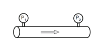

**Question**

A capillary viscometer (Fig. 4.7b) forces fluid through a tube of radius $R$ and length $L$ and measures the pressure drop $\Delta P$. The wall shear stress is obtained from the force balance, Equations (4.16) and (4.17). A tube has $R = 0.50\ \mathrm{mm}$, $L = 0.20\ \mathrm{m}$ and $\Delta P = 12\ \mathrm{kPa}$. A near-wall measurement gives $\left.dv_x/dr\right|_{r=R} = -8000\ \mathrm{s^{-1}}$.

(a) Compute the wall shear stress $\tau_w$

(b) Assuming Newtonian behavior ($\eta = \mu$), compute the viscosity $\mu$

{width=2.2in}

**Given:** $R$, $L$, $\Delta P$ and the wall velocity gradient $\left.dv_x/dr\right|_{r=R}$; Newtonian behavior for part (b).

**Additional assumptions:** steady, laminar, fully developed flow in a straight tube of constant radius, with $\Delta P = P_1 - P_2 > 0$ driving the flow in the $+x$-direction; the pressure is uniform over each cross-section; gravity along the tube axis is negligible.

## a Compute the wall shear stress

Convert the given quantities to SI units

$$R = 0.50\ \mathrm{mm}\left(\frac{1\ \mathrm{m}}{1000\ \mathrm{mm}}\right) = 5.0\times10^{-4}\ \mathrm{m}$$

$$\Delta P = 12\ \mathrm{kPa}\left(\frac{1000\ \mathrm{Pa}}{1\ \mathrm{kPa}}\right) = 12{,}000\ \mathrm{Pa}$$

Balance the forces on the cylinder of fluid filling the tube. The net pressure force on its two ends equals the shear force the wall exerts over its lateral surface. Using Equation (4.16)

$$\Delta P\left(\pi R^2\right) = 2\pi RL\,\tau_w$$

Divide both sides by $2\pi RL$ to isolate the wall shear stress. This gives the first equality of Equation (4.17)

$$\tau_w = \frac{\Delta P\,R}{2L}$$

Substitute the pressure drop, radius and length

$$\tau_w = \frac{\left(12{,}000\ \mathrm{Pa}\right)\left(5.0\times10^{-4}\ \mathrm{m}\right)}{2\left(0.20\ \mathrm{m}\right)} = \frac{6.0\ \mathrm{Pa\cdot m}}{0.40\ \mathrm{m}}$$

$$\boxed{\tau_w = 15\ \mathrm{Pa}}$$

**The wall shear stress is 15 Pa.** It is positive because the pressure decreases in the flow direction and the wall resists the motion.

## b Compute the viscosity

Relate the wall shear stress to the wall velocity gradient. Using the second equality of Equation (4.17)

$$\tau_w = -\eta\left.\frac{dv_x}{dr}\right|_{r=R}$$

For a Newtonian fluid $\eta = \mu$. Solve for $\mu$

$$\mu = \frac{-\tau_w}{\left.dv_x/dr\right|_{r=R}}$$

Substitute the wall shear stress from part (a) and the measured gradient. Use $1\ \mathrm{Pa} = 1\ \mathrm{N/m^2}$

$$\mu = \frac{-15\ \mathrm{Pa}}{-8000\ \mathrm{s^{-1}}} = 1.875\times10^{-3}\ \mathrm{Pa\cdot s}$$

Convert to centipoise, using $1\ \mathrm{cP} = 10^{-3}\ \mathrm{Pa\cdot s}$

$$\boxed{\mu = 1.875\times10^{-3}\ \mathrm{Pa\cdot s} \approx 1.9\times10^{-3}\ \mathrm{Pa\cdot s} = 1.9\ \mathrm{cP}}$$

**The viscosity is about 1.9 mPa·s**, roughly twice that of water at room temperature and in the range of blood plasma.

Check the sign and units. The velocity falls from its maximum on the centerline to zero at the wall, so $dv_x/dr < 0$ at $r = R$. The negative sign in Equation (4.17) therefore gives a positive viscosity directly. The units reduce as

$$\frac{\mathrm{Pa}}{\mathrm{s^{-1}}} = \mathrm{Pa\cdot s}$$

**Check against the source solution:** the problem statement and source write $\tau_w = \eta\left.dv_x/dr\right|_{r=R}$, without the negative sign that appears in Equation (4.17) on the slides. The source recovers a positive viscosity by taking the magnitude of the gradient. Keeping the sign from Equation (4.17), as above, gives the same value, $1.875\times10^{-3}\ \mathrm{Pa\cdot s}$, without that extra step. The source also switches from $\tau_w$ to $t_w$ partway through; both mean the wall shear stress.
