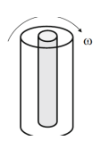

**Question**

A Couette viscometer places fluid between concentric cylinders; one cylinder rotates and the torque is measured. The inner cylinder rotates at $\omega = 120\ \mathrm{rad/s}$, and the outer cylinder is stationary. The viscometer has the following dimensions and measured torque:

- Inner radius $R_i = 0.025\ \mathrm{m}$
- Outer radius $R_o = 0.0255\ \mathrm{m}$, so the gap is $\delta = R_o - R_i = 5.0\times10^{-4}\ \mathrm{m}$
- Clearance at the bottom of the inner cylinder $h = 0.0255\ \mathrm{m}$
- Height of liquid in the annular space $H = 0.080\ \mathrm{m}$
- Measured torque $T = 0.092\ \mathrm{N\cdot m}$

Find the viscosity $\mu$.

{width=1.3in}

**Given:** $R_i$, $R_o$, $\delta$, $h$, $H$, $\omega$ and $T$ as listed above; the outer cylinder is stationary.

**Additional assumptions:** the fluid is Newtonian, so a single viscosity $\mu$ describes it; the flow is steady and laminar; the gap is thin compared with the radius ($\delta/R_i = 0.02$), so the velocity varies linearly across the side gap and across the bottom clearance; end effects at the free surface are negligible.

## 1 Select the working equation

The inner cylinder has a finite clearance $h$ below it. The measured torque therefore includes shear on the cylinder's side wall and shear on its bottom face. The slides give the viscosity for this case, with $R_1 = R_i$ and $R_2 = R_o$. This formula appears on the slides without an equation number

$$\mu = \frac{2\left(R_o - R_i\right)hT}{\pi R_i^2\,\omega\left[4HhR_o + R_i^2\left(R_o - R_i\right)\right]}$$

The first term in the brackets, $4HhR_o$, comes from the side wall. The second term, $R_i^2\left(R_o - R_i\right)$, comes from the bottom face.

## 2 Evaluate the numerator

Substitute the gap, clearance and torque

$$2\left(R_o - R_i\right)hT = 2\left(5.0\times10^{-4}\ \mathrm{m}\right)\left(0.0255\ \mathrm{m}\right)\left(0.092\ \mathrm{N\cdot m}\right)$$

$$2\left(R_o - R_i\right)hT = 2.346\times10^{-6}\ \mathrm{N\cdot m^3}$$

## 3 Evaluate the bracketed geometric term

Calculate the side-wall term

$$4HhR_o = 4\left(0.080\ \mathrm{m}\right)\left(0.0255\ \mathrm{m}\right)\left(0.0255\ \mathrm{m}\right) = 2.0808\times10^{-4}\ \mathrm{m^3}$$

Calculate the bottom-face term

$$R_i^2\left(R_o - R_i\right) = \left(0.025\ \mathrm{m}\right)^2\left(5.0\times10^{-4}\ \mathrm{m}\right) = \left(6.25\times10^{-4}\ \mathrm{m^2}\right)\left(5.0\times10^{-4}\ \mathrm{m}\right) = 3.125\times10^{-7}\ \mathrm{m^3}$$

Add the two terms

$$4HhR_o + R_i^2\left(R_o - R_i\right) = 2.0808\times10^{-4}\ \mathrm{m^3} + 0.003125\times10^{-4}\ \mathrm{m^3} = 2.0839\times10^{-4}\ \mathrm{m^3}$$

## 4 Evaluate the denominator

Calculate the prefactor

$$\pi R_i^2\,\omega = \pi\left(6.25\times10^{-4}\ \mathrm{m^2}\right)\left(120\ \mathrm{s^{-1}}\right) = 0.23562\ \mathrm{m^2/s}$$

The radian is dimensionless, so $\mathrm{rad/s}$ is written as $\mathrm{s^{-1}}$. Multiply by the bracketed term from Section 3

$$\pi R_i^2\,\omega\left[4HhR_o + R_i^2\left(R_o - R_i\right)\right] = \left(0.23562\ \mathrm{\frac{m^2}{s}}\right)\left(2.0839\times10^{-4}\ \mathrm{m^3}\right) = 4.9101\times10^{-5}\ \mathrm{\frac{m^5}{s}}$$

## 5 Calculate the viscosity

Divide the numerator by the denominator

$$\mu = \frac{2.346\times10^{-6}\ \mathrm{N\cdot m^3}}{4.9101\times10^{-5}\ \mathrm{m^5/s}} = 0.04778\ \mathrm{\frac{N\cdot s}{m^2}}$$

Convert the units, using $1\ \mathrm{N/m^2} = 1\ \mathrm{Pa}$ and $1\ \mathrm{cP} = 10^{-3}\ \mathrm{Pa\cdot s}$

$$\boxed{\mu = 0.0478\ \mathrm{Pa\cdot s} = 47.8\ \mathrm{cP}}$$

**The fluid viscosity is about 0.048 Pa·s**, roughly 50 times the viscosity of water at room temperature.

## 6 Check the result

Units check

$$\frac{\mathrm{m}\cdot\mathrm{m}\cdot\mathrm{N\cdot m}}{\mathrm{m^2}\cdot\mathrm{s^{-1}}\cdot\mathrm{m^3}} = \frac{\mathrm{N\cdot m^3}}{\mathrm{m^5/s}} = \frac{\mathrm{N\cdot s}}{\mathrm{m^2}} = \mathrm{Pa\cdot s}$$

Fraction of the torque carried by the bottom face

$$\frac{R_i^2\left(R_o - R_i\right)}{4HhR_o + R_i^2\left(R_o - R_i\right)} = \frac{3.125\times10^{-7}\ \mathrm{m^3}}{2.0839\times10^{-4}\ \mathrm{m^3}} = 0.0015$$

The bottom face carries only about $0.15\%$ of the torque, because the bottom clearance ($h = 0.0255\ \mathrm{m}$) is 51 times the side gap ($\delta = 5.0\times10^{-4}\ \mathrm{m}$), so the bottom shear rate is small.

For comparison, the ideal case on the slides ignores the space below the rotating cylinder. This formula also appears on the slides without an equation number

$$\mu = \frac{T\left(R_o^2 - R_i^2\right)}{4\pi\omega R_i^2 R_o^2 H}$$

Substitute the given values

$$\mu = \frac{\left(0.092\ \mathrm{N\cdot m}\right)\left[\left(0.0255\ \mathrm{m}\right)^2 - \left(0.025\ \mathrm{m}\right)^2\right]}{4\pi\left(120\ \mathrm{s^{-1}}\right)\left(0.025\ \mathrm{m}\right)^2\left(0.0255\ \mathrm{m}\right)^2\left(0.080\ \mathrm{m}\right)} = \frac{2.323\times10^{-6}\ \mathrm{N\cdot m^3}}{4.9028\times10^{-5}\ \mathrm{m^5/s}} = 0.0474\ \mathrm{Pa\cdot s}$$

The two results agree within about $1\%$. That is consistent with the small bottom-face contribution and the thin-gap approximation in the finite-clearance formula.

**Check against the source solution:** the source's final value is incorrect. In the side-wall term $4HhR_o$, it substitutes the gap $\delta = 5.0\times10^{-4}\ \mathrm{m}$ in place of the clearance $h = 0.0255\ \mathrm{m}$. It also reports a denominator of $6.135\times10^{-5}$, which does not follow from its own substitution; that substitution gives $1.035\times10^{-6}\ \mathrm{m^5/s}$. With $h = 0.0255\ \mathrm{m}$ substituted correctly, as in Sections 3–5, the viscosity is $0.0478\ \mathrm{Pa\cdot s}$, not $0.0382\ \mathrm{Pa\cdot s}$.

**Model note:** the given clearance $h = 0.0255\ \mathrm{m}$ equals the outer radius $R_o$, which is unusually large for a viscometer bottom gap and may be a typographical carry-over. It is used here as given. Because the bottom face carries so little of the torque, even a much smaller clearance would change the result only modestly. For example, $h = 5.0\times10^{-4}\ \mathrm{m}$ would give $\mu = 0.0444\ \mathrm{Pa\cdot s}$.
