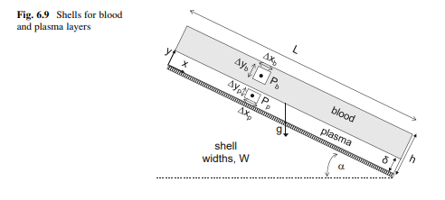
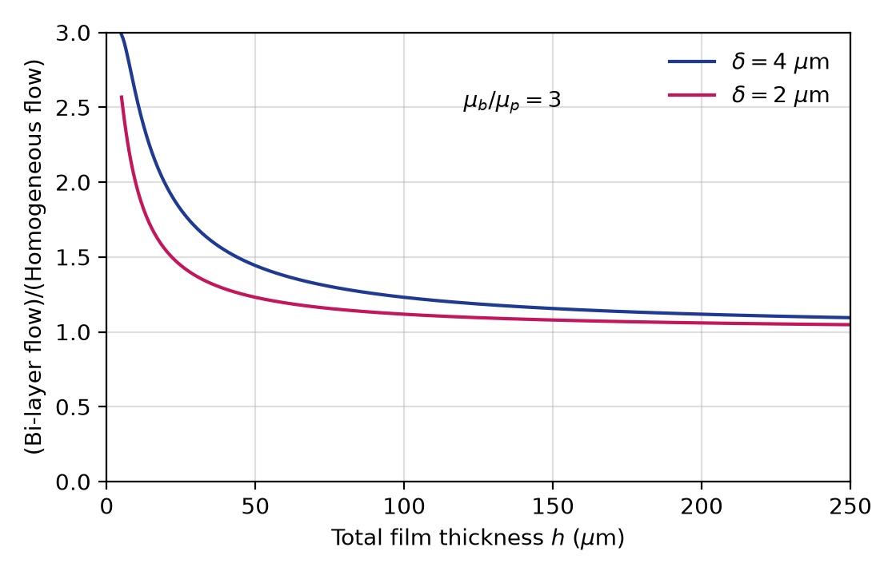

**Question**

Red blood cells travel faster, on average, than plasma in small tubes, because red-cell centers cannot come closer to a wall than one cell radius, while plasma can. A thin region near the wall, the marginal zone, is therefore composed mainly of plasma. It can be modeled as a cell-free plasma layer of thickness $\delta$ between the wall and the whole blood.

Blood flows down a plane inclined at angle $\alpha$ to the horizontal, as a film of total thickness $h$ and width $W$ (Fig. 6.9). Treat the blood as a two-fluid system: a plasma layer "p" of viscosity $\mu_p$ in $0 \le y \le \delta$, and whole blood "b" of viscosity $\mu_b$ in $\delta \le y \le h$, where $y$ is measured from the plate. Both fluids are Newtonian with the same density $\rho$.

Determine the velocity profile in each layer and the total volumetric flow rate. Compare the flow with that of a homogeneous Newtonian film of whole blood, and evaluate the comparison for $\mu_b/\mu_p = 3$ with plasma layers $\delta = 2\ \mu\mathrm{m}$ and $\delta = 4\ \mu\mathrm{m}$.

{width=4.5in}

**Given:** $\rho$ (the same in both layers), $\mu_p$, $\mu_b$, $\delta$, $h$, $W$ and $\alpha$; for the comparison, $\mu_b/\mu_p = 3$ and $\delta = 2$ or $4\ \mu\mathrm{m}$.

**Additional assumptions:** steady, laminar, fully developed parallel flow in both layers, so $v_x = v_x(y)$ only; the plasma and blood are immiscible and separated by a flat interface at $y = \delta$; the gas above the film exerts no shear; entrance and exit effects are negligible.

**Boundary conditions:**

- No slip at the plate, from Equation (4.5): $v_{x,p}(0) = 0$
- Zero shear stress at the free surface, from Equation (4.8): $\tau_{yx,b}(h) = 0$
- Continuity of velocity at the interface, from Equation (4.6): $v_{x,p}(\delta) = v_{x,b}(\delta)$
- Continuity of shear stress at the interface, from Equation (4.7): $\tau_{yx,p}(\delta) = \tau_{yx,b}(\delta)$

## 1 Find the shear-stress distribution in each layer

A momentum balance on a shell in either layer gives the same result as for the single-fluid film. Using Equation (6.22) in each layer

$$\frac{d\tau_{yx}}{dy} = \rho g\sin\alpha$$

Integrate in each layer, with a separate constant for each

$$\tau_{yx,b} = \left(\rho g\sin\alpha\right)y + C_b \quad \delta \le y \le h \qquad \tau_{yx,p} = \left(\rho g\sin\alpha\right)y + C_p \quad 0 \le y \le \delta$$

Apply zero shear stress at the free surface, $\tau_{yx,b}(h) = 0$

$$0 = \left(\rho g\sin\alpha\right)h + C_b \qquad C_b = -\rho gh\sin\alpha$$

Apply continuity of shear stress at the interface, $\tau_{yx,p}(\delta) = \tau_{yx,b}(\delta)$

$$\left(\rho g\sin\alpha\right)\delta + C_p = \left(\rho g\sin\alpha\right)\delta - \rho gh\sin\alpha \qquad C_p = C_b = -\rho gh\sin\alpha$$

The shear stress is therefore the same linear function in both layers. This is Equation (6.25)

$$\tau_{yx} = \rho g\left(y - h\right)\sin\alpha \qquad 0 \le y \le h$$

The shear stress depends only on the momentum balance and the free-surface condition, not on the viscosities.

## 2 Find the velocity profile in each layer

Substitute the Newtonian constitutive relation, using each layer's viscosity. Using Equation (6.26)

$$-\mu_i\frac{dv_x}{dy} = \rho g\left(y - h\right)\sin\alpha \qquad \frac{dv_x}{dy} = \frac{\rho g\sin\alpha}{\mu_i}\left(h - y\right) \qquad i = p,\ b$$

Integrate with respect to $y$

$$v_{x,p} = \frac{\rho g\sin\alpha}{\mu_p}\left(hy - \frac{y^2}{2}\right) + C_{p2} \qquad v_{x,b} = \frac{\rho g\sin\alpha}{\mu_b}\left(hy - \frac{y^2}{2}\right) + C_{b2}$$

Apply no slip at the plate, $v_{x,p}(0) = 0$

$$0 = 0 + C_{p2} \qquad C_{p2} = 0$$

Apply continuity of velocity at the interface, $v_{x,b}(\delta) = v_{x,p}(\delta)$

$$\frac{\rho g\sin\alpha}{\mu_b}\left(h\delta - \frac{\delta^2}{2}\right) + C_{b2} = \frac{\rho g\sin\alpha}{\mu_p}\left(h\delta - \frac{\delta^2}{2}\right)$$

Solve for $C_{b2}$ and factor out $\rho gh^2\sin\alpha/\mu_b$

$$C_{b2} = \rho g\sin\alpha\left(h\delta - \frac{\delta^2}{2}\right)\left(\frac{1}{\mu_p} - \frac{1}{\mu_b}\right) = \frac{\rho gh^2\sin\alpha}{\mu_b}\left(\frac{\mu_b}{\mu_p} - 1\right)\left(\frac{\delta}{h} - \frac{1}{2}\frac{\delta^2}{h^2}\right)$$

Substitute the constants. In each layer, factor $h^2$ out of $hy - y^2/2$

$$\boxed{0 \le y \le \delta: \quad v_{x,p} = \frac{\rho gh^2\sin\alpha}{\mu_p}\left(\frac{y}{h} - \frac{1}{2}\frac{y^2}{h^2}\right)}$$

$$\boxed{\delta \le y \le h: \quad v_{x,b} = \frac{\rho gh^2\sin\alpha}{\mu_b}\left[\left(\frac{y}{h} - \frac{1}{2}\frac{y^2}{h^2}\right) + \left(\frac{\mu_b}{\mu_p} - 1\right)\left(\frac{\delta}{h} - \frac{1}{2}\frac{\delta^2}{h^2}\right)\right]}$$

**The blood layer moves as if it were a homogeneous film riding on a faster, less viscous plasma layer.** The second term in the blood profile is a uniform velocity increase, carried up from the plasma layer.

Check the velocity gradient at the interface. The shear stress is continuous but the viscosities differ, so

$$\left.\left(\frac{dv_x}{dy}\right)_b\right|_{y=\delta} = \frac{\mu_p}{\mu_b}\left.\left(\frac{dv_x}{dy}\right)_p\right|_{y=\delta}$$

The profile has a kink at $y = \delta$: the plasma shears three times as steeply as the blood when $\mu_b/\mu_p = 3$.

## 3 Calculate the total volumetric flow rate

Add the flow in the two layers

$$Q_V = \int_0^\delta v_{x,p}\,W\,dy + \int_\delta^h v_{x,b}\,W\,dy$$

Change to $\xi = y/h$, $dy = h\,d\xi$, and write $d = \delta/h$, $m = \mu_b/\mu_p$ and $f(\xi) = \xi - \xi^2/2$. Because $1/\mu_p = m/\mu_b$, both layers share the factor $\rho gh^2\sin\alpha/\mu_b$

$$Q_V = \frac{\rho gWh^3\sin\alpha}{\mu_b}\left[m\int_0^d f(\xi)\,d\xi + \int_d^1 f(\xi)\,d\xi + \left(m - 1\right)f(d)\left(1 - d\right)\right]$$

Integrate $f$, using $F(\xi) = \xi^2/2 - \xi^3/6$ with $F(1) = 1/3$

$$m\,F(d) + \left[\frac{1}{3} - F(d)\right] + \left(m - 1\right)f(d)\left(1 - d\right) = \frac{1}{3} + \left(m - 1\right)\left[F(d) + f(d)\left(1 - d\right)\right]$$

Expand the bracket

$$F(d) + f(d)\left(1 - d\right) = \frac{d^2}{2} - \frac{d^3}{6} + d - d^2 - \frac{d^2}{2} + \frac{d^3}{2} = d - d^2 + \frac{d^3}{3}$$

Collect terms and factor out $1/3$

$$\boxed{Q_V = \frac{\rho gWh^3\sin\alpha}{3\mu_b}\left\{1 + 3\left(\frac{\mu_b}{\mu_p} - 1\right)\frac{\delta}{h}\left[1 - \frac{\delta}{h} + \frac{1}{3}\left(\frac{\delta}{h}\right)^2\right]\right\}}$$

## 4 Compare with a homogeneous blood film

For a homogeneous film of whole blood, the flow rate is Equation (6.31) with $\mu = \mu_b$

$$Q_{V,\text{hom}} = \frac{\rho gWh^3\sin\alpha}{3\mu_b}$$

Divide the bi-layer flow by the homogeneous flow

$$\boxed{\frac{Q_V}{Q_{V,\text{hom}}} = 1 + 3\left(\frac{\mu_b}{\mu_p} - 1\right)\frac{\delta}{h}\left[1 - \frac{\delta}{h} + \frac{1}{3}\left(\frac{\delta}{h}\right)^2\right]}$$

Check the limits:

- $\mu_b = \mu_p$ (no hematocrit difference): the ratio is 1, and Equation (6.31) is recovered.
- $\delta/h \to 0$ (a film much thicker than the plasma layer): the ratio tends to 1.
- $\delta = h$ (the whole film is plasma): the bracket equals $1/3$ and the ratio equals $\mu_b/\mu_p$, the flow of a plasma film.

Evaluate for $\mu_b/\mu_p = 3$, so $3\left(\mu_b/\mu_p - 1\right) = 6$. For $\delta = 4\ \mu\mathrm{m}$ and $h = 250\ \mu\mathrm{m}$, $\delta/h = 0.016$

$$\frac{Q_V}{Q_{V,\text{hom}}} = 1 + 6\left(0.016\right)\left[1 - 0.016 + \frac{1}{3}\left(0.016\right)^2\right] = 1 + \left(0.096\right)\left(0.9841\right) = 1.094$$

For $\delta = 2\ \mu\mathrm{m}$ and $h = 250\ \mu\mathrm{m}$, $\delta/h = 0.008$

$$\frac{Q_V}{Q_{V,\text{hom}}} = 1 + 6\left(0.008\right)\left[1 - 0.008 + \frac{1}{3}\left(0.008\right)^2\right] = 1 + \left(0.048\right)\left(0.9920\right) = 1.048$$

The same formula at other film thicknesses gives:

| $h$ ($\mu\mathrm{m}$) | $\delta = 2\ \mu\mathrm{m}$ | $\delta = 4\ \mu\mathrm{m}$ |
|:---:|:---:|:---:|
| 10 | 1.98 | 2.57 |
| 50 | 1.23 | 1.44 |
| 100 | 1.12 | 1.23 |
| 250 | 1.05 | 1.09 |

{width=4.5in}

The plotted curves reproduce Fig. 6.10.

::: {custom-style="Answer Box"}
The cell-free plasma layer increases flow compared with a homogeneous blood film, because the low-viscosity plasma lubricates the wall region where the shear rate is highest. The increase is large for thin films (about 2 to 2.6 times at h = 10 μm) and falls to 5–9% at h = 250 μm for plasma layers of 2–4 μm. This "plasma skimming" effect lowers the apparent viscosity of blood in thin films and narrow tubes.
:::

**Check:** the flow-rate formula was verified by numerically integrating both velocity profiles. Units: $\left(\mathrm{kg/m^3}\right)\left(\mathrm{m/s^2}\right)\left(\mathrm{m}\right)\left(\mathrm{m^3}\right)/\left(\mathrm{Pa\cdot s}\right) = \mathrm{m^3/s}$, and the bracketed factor is dimensionless.

**Check against the source solution:** the flow rate, flow ratio and interpretation are correct. As transcribed, the source writes the constitutive relation as $\mu\,dv_x/dy = \rho g\left(y - h\right)\sin\alpha$, without the negative sign of Equation (6.26). Its velocity profiles then carry brackets of the form $\left(\frac{1}{2}\frac{y^2}{h^2} - \frac{y}{h}\right)$, which would give negative (up-slope) velocities. With the sign of Equation (6.26), the brackets are $\left(\frac{y}{h} - \frac{1}{2}\frac{y^2}{h^2}\right)$, as above, and the velocities are positive down the plane. The source also calls the interface velocity condition a "no-slip" condition; it is the velocity-continuity condition of Equation (4.6).

**Model note:** representing the marginal zone as a sharp plasma layer of fixed thickness is an idealization; in reality the hematocrit rises gradually away from the wall. The Newtonian assumption is reasonable near the plate, where shear rates are high. It fails near the free surface, where the shear stress falls to zero and the yield stress of blood can create a slowly sheared or plug-like layer.
