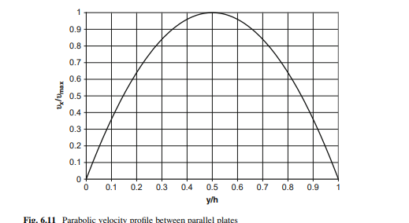

**Question**

Many devices used in biology and medicine, such as parallel-plate membrane blood oxygenators and dialysis units, force fluid through the narrow gap between parallel plates. Replace the free surface of the falling-film problem with a second stationary wall. The channel has height $h$, width $W$ and length $L$, and its axis makes an angle $\alpha$ with the horizontal. A pressure $P_0$ is imposed at the inlet ($x = 0$, $y = 0$) and a pressure $P_L$ at the outlet ($x = L$, $y = 0$).

Predict the flow of a Newtonian fluid through the channel under the pressure difference $P_0 - P_L$. Determine the pressure distribution, velocity profile, maximum velocity, volumetric flow rate and flow resistance.

**Given:** channel height $h$, width $W$, length $L$ and inclination $\alpha$; inlet and outlet pressures $P_0$ and $P_L$; fluid density $\rho$ and viscosity $\mu$. No numerical values are given, so the solution stays symbolic.

**Coordinates:** $x$ points down the channel axis, and $y$ is measured from the lower wall ($y = 0$) to the upper wall ($y = h$). Gravity has a component $g\sin\alpha$ in the $+x$-direction and a component $g\cos\alpha$ in the $-y$-direction.

**Additional assumptions:** steady, laminar, fully developed parallel flow, $v_x = v_x(y)$, with entrance effects neglected; incompressible Newtonian fluid with constant properties; no slip at both walls, from Equation (4.5).

Define the imposed pressure difference

$$\Delta P = P_0 - P_L$$

## 1 Apply the momentum balance in the x-direction

The shell and mass balance are the same as for the falling film, so $v_x$ depends only on $y$. The convective momentum terms cancel, as in Equations (6.17) and (6.19). Unlike the film, the pressure forces on the two ends of the shell do not cancel, because the pressure is imposed. The $x$-momentum balance on a shell of size $\Delta x\,\Delta y$ and width $W$ is

$$0 = \left[\left.\tau_{yx}\right|_y - \left.\tau_{yx}\right|_{y+\Delta y}\right]W\Delta x + \left[\left.P\right|_x - \left.P\right|_{x+\Delta x}\right]W\Delta y + \left(\rho g\sin\alpha\right)W\Delta x\,\Delta y$$

This is Equation (6.20) with the pressure term added; the slides do not number this form. Divide by the shell volume $W\Delta x\,\Delta y$ and let $\Delta x$ and $\Delta y$ approach zero

$$0 = -\frac{\partial\tau_{yx}}{\partial y} - \frac{\partial P}{\partial x} + \rho g\sin\alpha$$

In parallel flow, $\tau_{yx}$ depends only on $y$, so its derivative is an ordinary derivative

$$\frac{d\tau_{yx}}{dy} = -\frac{\partial P}{\partial x} + \rho g\sin\alpha$$

## 2 Find the pressure distribution

A momentum balance in the $y$-direction contains no shear or convective terms, because $v_y = 0$. The pressure force balances the weight component $\rho g\cos\alpha$, which acts in the $-y$-direction

$$-\frac{\partial P}{\partial y} - \rho g\cos\alpha = 0$$

Integrate with respect to $y$, with an arbitrary function $f(x)$ as the constant of integration

$$P(x, y) = -\left(\rho g\cos\alpha\right)y + f(x) \qquad \frac{\partial P}{\partial x} = \frac{df}{dx}$$

Substitute into the $x$-momentum equation

$$\frac{d\tau_{yx}}{dy} = -\frac{df}{dx} + \rho g\sin\alpha$$

The left side depends only on $y$ and the right side only on $x$. Both must therefore equal the same constant, $C_1$

$$\frac{d\tau_{yx}}{dy} = C_1 \qquad -\frac{df}{dx} + \rho g\sin\alpha = C_1$$

Integrate the second equation for $f(x)$

$$f(x) = \left(\rho g\sin\alpha - C_1\right)x + C_2$$

$$P(x, y) = -\left(\rho g\cos\alpha\right)y + \left(\rho g\sin\alpha - C_1\right)x + C_2$$

Apply the inlet pressure, $P(0, 0) = P_0$

$$P_0 = C_2$$

Apply the outlet pressure, $P(L, 0) = P_L$

$$P_L = \left(\rho g\sin\alpha - C_1\right)L + P_0$$

Solve for $C_1$

$$C_1 = \frac{P_0 - P_L}{L} + \rho g\sin\alpha = \frac{\Delta P}{L} + \rho g\sin\alpha$$

Substitute $C_1$ and $C_2$

$$\boxed{P(x, y) - P_0 = -\left(\rho g\cos\alpha\right)y - \frac{\Delta P}{L}x}$$

**At any height $y$, the pressure falls linearly along the channel**, so the axial pressure gradient, $\partial P/\partial x = -\Delta P/L$, is the same everywhere. Across the channel, the pressure varies hydrostatically with the weight of the fluid above.

## 3 Find the shear-stress and velocity profiles

Integrate $d\tau_{yx}/dy = C_1$ and introduce the Newtonian constitutive relation. Using Equation (6.26)

$$\tau_{yx} = -\mu\frac{dv_x}{dy} = \left(\frac{\Delta P}{L} + \rho g\sin\alpha\right)y + C_3$$

Divide by $-\mu$ and integrate again

$$v_x = -\frac{1}{\mu}\left(\frac{\Delta P}{L} + \rho g\sin\alpha\right)\frac{y^2}{2} - \frac{C_3}{\mu}y + C_4$$

Apply no slip at the lower wall, $v_x(0) = 0$

$$0 = C_4$$

Apply no slip at the upper wall, $v_x(h) = 0$

$$0 = -\frac{1}{\mu}\left(\frac{\Delta P}{L} + \rho g\sin\alpha\right)\frac{h^2}{2} - \frac{C_3}{\mu}h \qquad C_3 = -\left(\frac{\Delta P}{L} + \rho g\sin\alpha\right)\frac{h}{2}$$

Substitute $C_3$ and $C_4$, then factor out $h^2$

$$v_x = \frac{1}{2\mu}\left(\frac{\Delta P}{L} + \rho g\sin\alpha\right)\left(hy - y^2\right)$$

$$\boxed{v_x = \frac{h^2}{2\mu}\left(\frac{\Delta P}{L} + \rho g\sin\alpha\right)\left(\frac{y}{h} - \frac{y^2}{h^2}\right)}$$

The shear stress follows by substituting $C_3$

$$\tau_{yx} = \left(\frac{\Delta P}{L} + \rho g\sin\alpha\right)\left(y - \frac{h}{2}\right)$$

The shear stress is zero on the centerline, $y = h/2$, and largest in magnitude at the two walls.

**The velocity profile is parabolic and symmetric about the centerline** (Fig. 6.11). Pressure and gravity drive the flow together through the combined term $\Delta P/L + \rho g\sin\alpha$.

{width=4.2in}

## 4 Find the maximum velocity

By symmetry, the velocity is greatest on the centerline, where $dv_x/dy = 0$. Substitute $y = h/2$

$$v_{\max} = \frac{h^2}{2\mu}\left(\frac{\Delta P}{L} + \rho g\sin\alpha\right)\left(\frac{1}{2} - \frac{1}{4}\right)$$

$$\boxed{v_{\max} = \frac{h^2}{8\mu}\left(\frac{\Delta P}{L} + \rho g\sin\alpha\right) \quad \text{at } y = \frac{h}{2}}$$

The profile can then be written as $v_x/v_{\max} = 4\left(y/h\right)\left(1 - y/h\right)$, the curve plotted in Fig. 6.11.

## 5 Calculate the volumetric flow rate

Integrate the velocity over the channel cross-section

$$Q_V = \int_0^h v_x\,W\,dy$$

Change to $\xi = y/h$, $dy = h\,d\xi$

$$Q_V = \frac{Wh^3}{2\mu}\left(\frac{\Delta P}{L} + \rho g\sin\alpha\right)\int_0^1\left(\xi - \xi^2\right)d\xi$$

Integrate

$$\int_0^1\left(\xi - \xi^2\right)d\xi = \left[\frac{\xi^2}{2} - \frac{\xi^3}{3}\right]_0^1 = \frac{1}{2} - \frac{1}{3} = \frac{1}{6}$$

Multiply by the prefactor and combine over the common denominator $L$

$$\boxed{Q_V = \frac{Wh^3}{12\mu}\left(\frac{\Delta P}{L} + \rho g\sin\alpha\right) = \frac{Wh^3}{12\mu L}\left(\Delta P + \rho gL\sin\alpha\right)}$$

The average velocity is $\langle v_x\rangle = Q_V/\left(Wh\right) = \frac{2}{3}v_{\max}$.

## 6 Interpret the result and find the flow resistance

**Dependence on geometry and properties.** The flow rate is proportional to the width $W$ and inversely proportional to the viscosity $\mu$. It varies with the cube of the channel height $h$, so small changes in the gap produce large changes in flow. For a fixed pressure difference, the pressure contribution varies as $1/L$, because the driving gradient is $\Delta P/L$. The gravity contribution does not depend on $L$.

**Direction of flow.** The flow is zero when the pressure and gravity terms cancel

$$\Delta P + \rho gL\sin\alpha = 0 \qquad \Delta P = -\rho gL\sin\alpha$$

::: {custom-style="Answer Box"}
The flow is down the channel (positive) when ΔP > −ρgL sin α and up the channel (negative) when ΔP < −ρgL sin α. It is zero when the outlet pressure exceeds the inlet pressure by exactly ρgL sin α, so that the adverse pressure difference just balances gravity. With a horizontal channel (α = 0) and no imposed pressure difference, there is no flow.
:::

**Flow resistance.** By analogy with Equation (6.53), the resistance is the total driving pressure divided by the flow rate

$$\Re_f = \frac{\Delta P + \rho gL\sin\alpha}{Q_V}$$

$$\boxed{\Re_f = \frac{12\mu L}{Wh^3}}$$

**The resistance depends only on the fluid viscosity and the channel geometry.** Every fluid element feels the same axial pressure gradient, even though the pressure itself depends on both $x$ and $y$.

**Check:**

- *No-slip conditions:* $v_x(0) = v_x(h) = 0$ from the $\left(y/h - y^2/h^2\right)$ factor.
- *Units of $Q_V$:* $\left(\mathrm{m}\right)\left(\mathrm{m^3}\right)\left(\mathrm{Pa}\right)/\left(\mathrm{Pa\cdot s}\cdot\mathrm{m}\right) = \mathrm{m^3/s}$. Both driving terms, $\Delta P$ and $\rho gL\sin\alpha$, have units of pressure.
- *Units of $\Re_f$:* $\left(\mathrm{Pa\cdot s}\right)\left(\mathrm{m}\right)/\mathrm{m^4} = \mathrm{Pa\cdot s/m^3}$, the same as the Poiseuille resistance of Equation (6.53).
- *Link to the falling film:* with $\Delta P = 0$, a channel of height $H$ carries $Q_V = \rho gWH^3\sin\alpha/\left(12\mu\right)$. A falling film of thickness $H/2$ carries, from Equation (6.31), $\rho gW\left(H/2\right)^3\sin\alpha/\left(3\mu\right) = \rho gWH^3\sin\alpha/\left(24\mu\right)$. The channel therefore carries exactly twice the film flow. By symmetry, the zero-shear centerline of the channel plays the role of the film's free surface, and each half of the channel matches the film profile of Equation (6.28) with $h = H/2$.

**Check against the source solution:** the pressure distribution, velocity profile, maximum velocity, flow rate and resistance are correct. Three corrections:

- As transcribed, the source states that flow is positive if $\Delta P > \rho gL\sin\alpha$ and negative if $\Delta P < \rho gL\sin\alpha$. The threshold is $-\rho gL\sin\alpha$, consistent with its own zero-flow condition $\Delta P = -\rho gL\sin\alpha$.
- The source says the flow is "directly proportional to the length" of the channel. For a fixed $\Delta P$, the pressure-driven part of the flow is inversely proportional to $L$, and the gravity-driven part does not depend on $L$.
- The source labels the maximum velocity "(6.32a)". That number does not appear on the slides, where Equation (6.32) is the falling-film thickness, so it is not used here.
