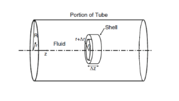

**Question**

Blood flows steadily through a cylindrical hollow fiber in a hemodialyzer. The fiber has an internal radius $R = 0.25\ \mathrm{mm}$, and the mean axial blood velocity is $\langle v_z\rangle = 0.10\ \mathrm{m/s}$. The axial velocity profile is fully developed and parabolic. Because fluid is filtered through the porous fiber wall, the outward radial velocity at the wall is $v_r(R) = 1.0\times10^{-5}\ \mathrm{m/s}$. Blood behaves as a Newtonian fluid with $\rho = 1060\ \mathrm{kg/m^3}$ and $\mu = 3.5\times10^{-3}\ \mathrm{Pa\cdot s}$.

(a) Write the fully developed axial velocity profile $v_z(r)$ in terms of the mean velocity $\langle v_z\rangle$

(b) Determine the axial velocity gradient $dv_z/dr$ at the fiber wall

(c) Determine the molecular flux of axial momentum in the radial direction, $\tau_{rz}$, at the wall

(d) Determine the convective flux of axial momentum in the radial direction at the wall, $\rho v_r v_z$

(e) Compare the molecular and convective contributions to radial transport of axial momentum at the wall, and explain which mechanism dominates

{width=3.2in}

**Given:** $R$, $\langle v_z\rangle$, $v_r(R)$, $\rho$ and $\mu$; the flow is steady, fully developed and parabolic, and the blood is Newtonian.

**Additional assumptions:** the fiber wall is stationary, so the no-slip condition $v_z(R) = 0$ applies to the axial velocity even though fluid passes radially through the porous wall. The filtration velocity is small enough that it does not distort the parabolic axial profile; Section (e) confirms this.

Convert the fiber radius to meters

$$R = 0.25\ \mathrm{mm}\left(\frac{1\ \mathrm{m}}{1000\ \mathrm{mm}}\right) = 2.5\times10^{-4}\ \mathrm{m}$$

## a Write the axial velocity profile

For fully developed Newtonian flow in a circular tube, the velocity is parabolic. Using Equations (6.49) and (6.50)

$$v_z(r) = \frac{\Delta P R^2}{4\mu L}\left(1 - \frac{r^2}{R^2}\right) = v_{\max}\left(1 - \frac{r^2}{R^2}\right)$$

The mean velocity is half the centerline velocity. Using Equation (6.51)

$$\langle v_z\rangle = \frac{v_{\max}}{2} \qquad v_{\max} = 2\langle v_z\rangle$$

Substitute to express the profile in terms of the mean velocity

$$v_z(r) = 2\langle v_z\rangle\left(1 - \frac{r^2}{R^2}\right)$$

Substitute $\langle v_z\rangle = 0.10\ \mathrm{m/s}$

$$\boxed{v_z(r) = \left(0.20\ \mathrm{m/s}\right)\left(1 - \frac{r^2}{R^2}\right) \qquad R = 2.5\times10^{-4}\ \mathrm{m}}$$

Check the boundary values: $v_z(0) = 0.20\ \mathrm{m/s} = v_{\max}$ on the centerline, and $v_z(R) = 0$ at the wall, as no slip requires.

## b Calculate the velocity gradient at the wall

Differentiate the profile with respect to $r$

$$\frac{dv_z}{dr} = 2\langle v_z\rangle\frac{d}{dr}\left(1 - \frac{r^2}{R^2}\right) = 2\langle v_z\rangle\left(-\frac{2r}{R^2}\right) = -\frac{4\langle v_z\rangle r}{R^2}$$

Evaluate at the wall, $r = R$

$$\left.\frac{dv_z}{dr}\right|_{r=R} = -\frac{4\langle v_z\rangle}{R}$$

Substitute the mean velocity and radius

$$\left.\frac{dv_z}{dr}\right|_{r=R} = -\frac{4\left(0.10\ \mathrm{m/s}\right)}{2.5\times10^{-4}\ \mathrm{m}}$$

$$\boxed{\left.\frac{dv_z}{dr}\right|_{r=R} = -1.60\times10^{3}\ \mathrm{s^{-1}}}$$

**The gradient is negative** because the axial velocity decreases from its centerline maximum to zero at the wall.

## c Calculate the molecular flux of axial momentum at the wall

The shear stress is the molecular flux of $z$-momentum in the $r$-direction. For a Newtonian fluid, using Equation (6.46)

$$\tau_{rz} = -\mu\frac{dv_z}{dr}$$

Substitute the viscosity and the wall gradient from part (b)

$$\tau_{rz}(R) = -\left(3.5\times10^{-3}\ \mathrm{Pa\cdot s}\right)\left(-1.60\times10^{3}\ \mathrm{s^{-1}}\right)$$

$$\boxed{\tau_{rz}(R) = 5.60\ \mathrm{Pa}}$$

**The positive sign means axial momentum is transported by molecular motion in the $+r$-direction**, outward from the fast-moving core toward the wall, where it is lost to the stationary fiber as wall friction.

## d Calculate the convective flux of axial momentum at the wall

The convective flux of $z$-momentum in the $r$-direction is the axial momentum per unit volume, $\rho v_z$, carried by the radial velocity $v_r$. This is the cross-direction form of the convective momentum flux in Equation (2.22), $\rho v_x^2$. The slides do not number this form

$$J_{rz,\text{conv}} = \rho v_r v_z$$

Evaluate at the wall, where no slip gives $v_z(R) = 0$ from part (a)

$$J_{rz,\text{conv}}(R) = \rho\,v_r(R)\,v_z(R) = \left(1060\ \mathrm{\frac{kg}{m^3}}\right)\left(1.0\times10^{-5}\ \mathrm{\frac{m}{s}}\right)\left(0\ \mathrm{\frac{m}{s}}\right)$$

$$\boxed{J_{rz,\text{conv}}(R) = 0\ \mathrm{Pa}}$$

**The convective flux at the wall is exactly zero.** Fluid does cross the porous wall radially, but the fluid at the wall has no axial velocity, so it carries no axial momentum with it.

## e Compare the molecular and convective contributions

Compare the two fluxes at the wall

$$J_{rz,\text{molecular}}(R) = \tau_{rz}(R) = 5.60\ \mathrm{Pa} \qquad J_{rz,\text{conv}}(R) = 0\ \mathrm{Pa}$$

::: {custom-style="Answer Box"}
Molecular (viscous) transport carries all of the radial flux of axial momentum at the wall: 5.60 Pa, against 0 Pa by convection. Convection vanishes because the no-slip condition makes the axial velocity zero at the wall, so the filtrate leaving through the wall carries no axial momentum.
:::

Estimate the largest possible convective flux anywhere in the fiber by pairing the wall filtration velocity with the centerline velocity. Inside the fiber the radial velocity is no larger than its wall value, so this is an upper bound, not the wall value

$$\rho\,v_r(R)\,v_{\max} = \left(1060\ \mathrm{\frac{kg}{m^3}}\right)\left(1.0\times10^{-5}\ \mathrm{\frac{m}{s}}\right)\left(0.20\ \mathrm{\frac{m}{s}}\right) = 2.12\times10^{-3}\ \mathrm{Pa}$$

$$\frac{\tau_{rz}(R)}{\rho\,v_r(R)\,v_{\max}} = \frac{5.60\ \mathrm{Pa}}{2.12\times10^{-3}\ \mathrm{Pa}} \approx 2.6\times10^{3}$$

Even under this generous bound, molecular transport exceeds convective transport by more than three orders of magnitude. The filtration flow is far too slow to carry significant axial momentum.

**Check:** the units of the convective flux reduce as $\left(\mathrm{kg/m^3}\right)\left(\mathrm{m/s}\right)\left(\mathrm{m/s}\right) = \mathrm{kg/\left(m\cdot s^2\right)} = \mathrm{N/m^2} = \mathrm{Pa}$, the same as the shear stress. Both are momentum fluxes. The wall Reynolds number based on the filtration velocity, $\rho v_r(R)R/\mu = \left(1060\right)\left(1.0\times10^{-5}\right)\left(2.5\times10^{-4}\right)/\left(3.5\times10^{-3}\right) = 7.6\times10^{-4}$, is far below 1. This confirms that filtration does not distort the parabolic axial profile. The axial Reynolds number, $\rho\langle v_z\rangle\left(2R\right)/\mu = 15$, confirms laminar flow, as required by Equation (6.49).

**Check against the source solution:** all of the source's results are correct: $-1.60\times10^{3}\ \mathrm{s^{-1}}$, $5.60\ \mathrm{Pa}$, $0$, and dominance of molecular transport. The upper-bound comparison above is added to show that the conclusion also holds away from the wall.
