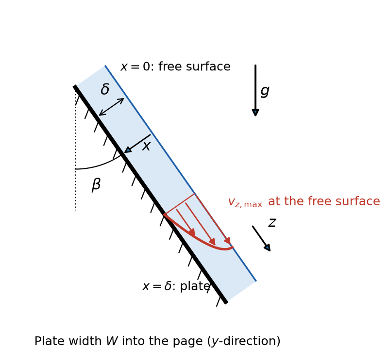

**Question**

The velocity profile of a liquid flowing down an inclined plane, as shown in the figure, is

$$v_z = \frac{\rho g\delta^2\cos\beta}{2\mu}\left[1 - \left(\frac{x}{\delta}\right)^2\right]$$

1. Where is the maximum velocity?
2. What is the average velocity over the cross-section of the falling film?
3. What is the mass flow?
4. What is the film thickness?
5. Confirm that the equation above applies

{width=4.2in}

**Given:** the velocity profile $v_z(x)$, in which $\rho$ is the liquid density, $\mu$ its viscosity, $g$ the gravitational acceleration, $\delta$ the film thickness and $\beta$ the angle between the plate and the vertical. No numerical values are given, so the solution stays symbolic.

**Coordinates, as implied by the profile:** $z$ points down the plate in the flow direction; $x$ is measured from the free surface ($x = 0$) into the film to the plate ($x = \delta$); $y$ runs across the plate width, $0 \le y \le W$.

**Additional assumptions:** steady, fully developed, laminar flow of an incompressible Newtonian liquid with constant properties; the film is far from the entrance and exit, so end effects are negligible; the gas above the free surface exerts negligible shear.

**Link to the slides:** the slides solve the same falling film with $y$ measured from the plate, film thickness $h$ and inclination $\alpha$ measured from the horizontal, in Equations (6.28)–(6.32). Because $\alpha = 90^\circ - \beta$, $\sin\alpha = \cos\beta$, and with $h = \delta$ the results below reduce to those equations.

## 1 Locate the maximum velocity

Differentiate the profile with respect to $x$

$$\frac{dv_z}{dx} = \frac{\rho g\delta^2\cos\beta}{2\mu}\left(-\frac{2x}{\delta^2}\right) = -\frac{\rho g\cos\beta}{\mu}x$$

Set the derivative to zero

$$-\frac{\rho g\cos\beta}{\mu}x = 0 \qquad x = 0$$

The second derivative, $d^2v_z/dx^2 = -\rho g\cos\beta/\mu$, is negative, so $x = 0$ is a maximum. Substitute $x = 0$ into the profile

$$\boxed{v_{z,\max} = v_z(0) = \frac{\rho g\delta^2\cos\beta}{2\mu} \quad \text{at the free surface, } x = 0}$$

**The maximum velocity occurs at the free surface.** There the shear stress is zero, the liquid–gas boundary condition of Equation (4.8), so the velocity gradient vanishes. This matches Equation (6.29) with $h = \delta$ and $\sin\alpha = \cos\beta$.

## 2 Calculate the average velocity

Average the velocity over the film cross-section, $0 \le x \le \delta$ and $0 \le y \le W$

$$\langle v_z\rangle = \frac{\int_0^W\int_0^\delta v_z\,dx\,dy}{\int_0^W\int_0^\delta dx\,dy}$$

The velocity does not depend on $y$, so the $y$-integrals cancel

$$\langle v_z\rangle = \frac{W\int_0^\delta v_z\,dx}{W\delta} = \frac{1}{\delta}\int_0^\delta v_z\,dx$$

Substitute the profile and change to the dimensionless position $\xi = x/\delta$, so $dx = \delta\,d\xi$ with limits $0$ and $1$

$$\langle v_z\rangle = \frac{\rho g\delta^2\cos\beta}{2\mu}\int_0^1\left(1 - \xi^2\right)d\xi$$

Integrate

$$\int_0^1\left(1 - \xi^2\right)d\xi = \left[\xi - \frac{\xi^3}{3}\right]_0^1 = 1 - \frac{1}{3} = \frac{2}{3}$$

Multiply by the prefactor

$$\boxed{\langle v_z\rangle = \frac{\rho g\delta^2\cos\beta}{3\mu} = \frac{2}{3}v_{z,\max}}$$

**The average velocity is two-thirds of the free-surface velocity.** This matches Equation (6.30) with $h = \delta$ and $\sin\alpha = \cos\beta$.

## 3 Calculate the mass flow rate

Integrate the mass flux, $\rho v_z$, over the film cross-section. The integral of $v_z$ is the average velocity times the area $W\delta$

$$w = \int_0^W\int_0^\delta\rho v_z\,dx\,dy = \rho W\delta\langle v_z\rangle$$

Substitute the average velocity from Section 2

$$\boxed{w = \frac{\rho^2 gW\delta^3\cos\beta}{3\mu}}$$

**The mass flow rate grows with the cube of the film thickness.** This equals $\rho$ times the volumetric flow rate of Equation (6.31), with $h = \delta$ and $\sin\alpha = \cos\beta$.

## 4 Express the film thickness

Solve the average-velocity result of Section 2 for $\delta$

$$\delta^2 = \frac{3\mu\langle v_z\rangle}{\rho g\cos\beta} \qquad \delta = \left(\frac{3\mu\langle v_z\rangle}{\rho g\cos\beta}\right)^{1/2}$$

Alternatively, solve the mass-flow result of Section 3 for $\delta$, which is more useful when the flow rate is known

$$\delta^3 = \frac{3\mu w}{\rho^2 gW\cos\beta}$$

$$\boxed{\delta = \left(\frac{3\mu\langle v_z\rangle}{\rho g\cos\beta}\right)^{1/2} = \left(\frac{3\mu w}{\rho^2 gW\cos\beta}\right)^{1/3}}$$

**For a given flow rate, the film thickness varies as the cube root of the flow per unit width.** This matches Equation (6.32) with $Q_V = w/\rho$, $h = \delta$ and $\sin\alpha = \cos\beta$.

## 5 Confirm that the velocity profile applies

The parabolic profile was derived for steady, laminar, rectilinear flow. It applies only if the Reynolds number of the film is low enough for the flow to be laminar. The Reynolds number compares convective and molecular transport of momentum. Using Equation (3.7), with the characteristic length taken as the hydraulic diameter $D_h$

$$\mathrm{Re} = \frac{\rho\langle v_z\rangle D_h}{\mu}$$

The hydraulic diameter is four times the flow area $A$ divided by the wetted perimeter $P$. This definition does not appear on the slides

$$D_h = \frac{4A}{P}$$

The film has flow area $A = W\delta$. Only the plate surface is wetted, because the free surface is in contact with gas, so $P = W$

$$D_h = \frac{4W\delta}{W} = 4\delta$$

Substitute $D_h = 4\delta$, then use $\langle v_z\rangle = w/\left(\rho W\delta\right)$ from Section 3

$$\mathrm{Re} = \frac{4\delta\langle v_z\rangle\rho}{\mu} = \frac{4\delta\rho}{\mu}\cdot\frac{w}{\rho W\delta} = \frac{4w}{W\mu}$$

::: {custom-style="Answer Box"}
The profile applies when the film Reynolds number, Re = 4δ⟨v_z⟩ρ/μ = 4w/(Wμ), is below about 1500, so that the flow is laminar. For the film surface to stay smooth, as assumed in the derivation, Re should be below about 20. The film must also be far from the entrance and exit, and the fluid must be Newtonian with constant properties.
:::

**Interpretation:** the upper limit of about 1500 marks the change from laminar to turbulent film flow. Between about 20 and 1500, the flow is still laminar, but ripples form on the free surface, so the flat-surface profile is only approximate. Below about 20, the profile applies exactly.

**Check:** units of $\langle v_z\rangle$: $\mathrm{(kg/m^3)(m/s^2)(m^2)/(Pa\cdot s)} = \mathrm{(kg/(m\cdot s^2))\,m}\big/\mathrm{(kg/(m\cdot s))} = \mathrm{m/s}$. Units of $w$: $\mathrm{(kg/m^3)(m)(m)(m/s)} = \mathrm{kg/s}$. The Reynolds number is dimensionless: $\mathrm{(kg/s)}/\mathrm{(m\cdot Pa\cdot s)} = \mathrm{(kg/s)}/\mathrm{(kg/s)} = 1$. In the limit $\beta = 90^\circ$ (horizontal plate), $\cos\beta = 0$ and all flow stops, as expected.

**Check against the source solution:** all of the source's results are correct. It cites "5.62 and 5.90" for the hydraulic diameter. Those equation numbers do not appear on the slides, so they are omitted here, and $D_h = 4A/P$ is presented without a number. The limit of 1500 in the source is the laminar–turbulent transition. The profile is exact only for a smooth, ripple-free film, below $\mathrm{Re} \approx 20$.
