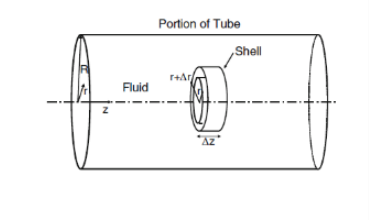

**Question**

Blood with a hematocrit of 45% flows through a horizontal arteriole of diameter $D = 20\ \mu\mathrm{m}$ and length $L = 2\ \mathrm{mm}$. The pressure is $P_0 = 60\ \mathrm{mmHg}$ at the entrance and $P_L = 20\ \mathrm{mmHg}$ at the exit. Calculate the maximum shear stress, and state where it occurs.

{width=3.2in}

**Given:** $D = 20\ \mu\mathrm{m}$, $L = 2\ \mathrm{mm}$, $P_0 = 60\ \mathrm{mmHg}$, $P_L = 20\ \mathrm{mmHg}$, hematocrit 45%; the arteriole is horizontal.

**Additional assumptions:** steady, laminar, fully developed flow in a straight, rigid tube of constant circular cross-section; the flow is one-dimensional, $v_z = v_z(r)$; gravity does not act along the horizontal axis. No constitutive relation for blood is needed, because the shear-stress distribution follows from the momentum balance alone.

## 1 Convert the given values

Tube radius

$$R = \frac{D}{2} = \frac{20\ \mu\mathrm{m}}{2}\left(\frac{1\ \mathrm{m}}{10^{6}\ \mu\mathrm{m}}\right) = 1.0\times10^{-5}\ \mathrm{m}$$

Tube length

$$L = 2\ \mathrm{mm}\left(\frac{1\ \mathrm{m}}{1000\ \mathrm{mm}}\right) = 2.0\times10^{-3}\ \mathrm{m}$$

Pressure drop, using $1\ \mathrm{mmHg} = 133.322\ \mathrm{Pa}$

$$P_0 - P_L = 60\ \mathrm{mmHg} - 20\ \mathrm{mmHg} = 40\ \mathrm{mmHg}$$

$$P_0 - P_L = 40\ \mathrm{mmHg}\left(\frac{133.322\ \mathrm{Pa}}{1\ \mathrm{mmHg}}\right) = 5332.88\ \mathrm{Pa}$$

## 2 Obtain the shear-stress distribution from the momentum balance

A momentum balance on the cylindrical shell in the figure relates the shear stress to the axial pressure gradient. Using Equation (6.38)

$$\frac{1}{r}\frac{d\left(r\tau_{rz}\right)}{dr} = -\frac{dP}{dz}$$

The pressure falls linearly from $P_0$ to $P_L$ along the tube. Using Equations (6.40) and (6.42)

$$-\frac{dP}{dz} = C_1 = \frac{P_0 - P_L}{L}$$

Multiply by $r$ and integrate with respect to $r$

$$\frac{d\left(r\tau_{rz}\right)}{dr} = \left(\frac{P_0 - P_L}{L}\right)r \qquad r\tau_{rz} = \left(\frac{P_0 - P_L}{L}\right)\frac{r^2}{2} + C_3$$

Divide by $r$. This gives Equation (6.43)

$$\tau_{rz} = \left(\frac{P_0 - P_L}{L}\right)\frac{r}{2} + \frac{C_3}{r}$$

Apply the boundary condition that the shear stress stays finite, and equals zero, on the centerline, $\tau_{rz} = 0$ at $r = 0$. The term $C_3/r$ would be infinite at $r = 0$ unless $C_3 = 0$. This gives Equation (6.44)

$$\tau_{rz} = \left(\frac{P_0 - P_L}{2L}\right)r$$

The shear stress increases linearly from zero on the centerline to its largest value at the wall, $r = R$.

## 3 Calculate the maximum (wall) shear stress

Evaluate the distribution at $r = R$. Using Equation (6.45)

$$\tau_w = \left.\tau_{rz}\right|_{r=R} = \left(\frac{P_0 - P_L}{2L}\right)R$$

Substitute the pressure drop, length and radius

$$\tau_w = \frac{\left(5332.88\ \mathrm{Pa}\right)\left(1.0\times10^{-5}\ \mathrm{m}\right)}{2\left(2.0\times10^{-3}\ \mathrm{m}\right)} = \frac{0.0533288\ \mathrm{Pa\cdot m}}{4.0\times10^{-3}\ \mathrm{m}} = 13.33\ \mathrm{Pa}$$

Convert to $\mathrm{dyn/cm^2}$, using $1\ \mathrm{Pa} = 10\ \mathrm{dyn/cm^2}$

$$\boxed{\tau_{\max} = \tau_w \approx 13.3\ \mathrm{Pa} = 133\ \mathrm{dyn/cm^2} \quad \text{at the vessel wall, } r = R = 10\ \mu\mathrm{m}}$$

**The maximum shear stress acts on the arteriole wall**, where $r = R$. The shear stress is zero on the centerline, $r = 0$, and grows linearly with $r$ in between.

## 4 Check the result

Units check

$$\frac{\mathrm{Pa}\cdot\mathrm{m}}{\mathrm{m}} = \mathrm{Pa}$$

Force-balance check: the net pressure force on the fluid cylinder equals the wall shear force on its surface, as in Equation (4.16)

$$\left(P_0 - P_L\right)\pi R^2 = \tau_w\left(2\pi RL\right) \qquad \tau_w = \frac{\left(P_0 - P_L\right)R}{2L}$$

The same expression results, so the wall shear stress depends only on the pressure drop and the tube geometry.

**Role of the hematocrit:** the shear-stress distribution comes from the momentum balance alone, before any constitutive relation is used. It therefore holds for Newtonian blood and for non-Newtonian models, such as the Casson model, alike. The hematocrit affects the apparent viscosity, and so the velocity profile, wall shear rate and flow rate, but it does not affect $\tau_w$ once $P_0 - P_L$, $L$ and $R$ are specified.

**Check against the source solution:** the source's result, $13.3\ \mathrm{Pa}$ at the wall, is correct. Its second method starts from the Newtonian parabolic profile, Equation (6.49), and uses Equation (6.46) to recover the same $\tau_w$. Its closing note says that $\tau_w$ "follows directly from the parabolic solution". The result does not actually need the parabolic, Newtonian profile: Equation (6.44) comes from the momentum balance alone, which is why the first method holds for any fluid.

**Model note:** $133\ \mathrm{dyn/cm^2}$ is high for an arteriole, where typical wall shear stresses are tens of $\mathrm{dyn/cm^2}$. The imposed pressure gradient, $40\ \mathrm{mmHg}$ over $2\ \mathrm{mm}$, is large. In a $20\ \mu\mathrm{m}$ vessel, red cells are comparable in size to the lumen, so the continuum assumption is only approximate.
