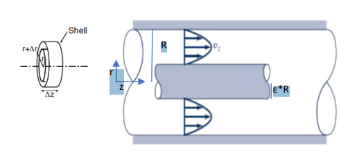

**Question**

Blood flows around a catheter placed within a vein in the body. The vein has $D = 1\ \mathrm{cm}$ and length $L = 5\ \mathrm{cm}$. The radius of the catheter is $\varepsilon R = 2\ \mathrm{mm}$. The pressure drop from the inlet to the outlet of the blood vessel is $\Delta P = 1\ \mathrm{mmHg}$. The velocity of the blood around the catheter is

$$v_z = \frac{\Delta P R^2}{4\mu L}\left[\left(1 - \frac{r^2}{R^2}\right) - \frac{1 - \varepsilon^2}{\ln\varepsilon}\ln\!\left(\frac{r}{R}\right)\right]$$

Assume one-dimensional flow in the $z$-direction.

a. Calculate the rate of flow of blood around the catheter

b. What is the maximum shear rate, and where does it occur?

{width=4.5in}

**Given:** $D = 1\ \mathrm{cm}$, $L = 5\ \mathrm{cm}$, $\varepsilon R = 2\ \mathrm{mm}$, $\Delta P = 1\ \mathrm{mmHg}$, and the velocity profile $v_z(r)$. The derivation of the profile is not required.

**Additional assumptions:**

- $D = 1\ \mathrm{cm}$ is the vein diameter, so the vein radius is $R = D/2 = 0.5\ \mathrm{cm}$. The problem calls $D$ a radius, but the symbol $D$ and the source solution both use $R = 0.5\ \mathrm{cm}$. The Model note gives the result for $R = 1\ \mathrm{cm}$.
- The blood viscosity is not given. The value $\mu = 3.5\ \mathrm{cP} = 0.0035\ \mathrm{Pa\cdot s}$, typical of whole blood at normal hematocrit and $37\ ^\circ\mathrm{C}$, is assumed, as in the source. At the shear rates found in part (b), above $10^3\ \mathrm{s^{-1}}$, blood behaves nearly as a Newtonian fluid.
- The flow is steady, laminar and fully developed. The catheter is concentric with the vein and stationary, and both walls obey no slip.

## Convert the given values

Vein radius

$$R = \frac{D}{2} = \frac{1\ \mathrm{cm}}{2}\left(\frac{1\ \mathrm{m}}{100\ \mathrm{cm}}\right) = 0.005\ \mathrm{m}$$

Catheter radius and radius ratio

$$\varepsilon R = 2\ \mathrm{mm}\left(\frac{1\ \mathrm{m}}{1000\ \mathrm{mm}}\right) = 0.002\ \mathrm{m} \qquad \varepsilon = \frac{0.002\ \mathrm{m}}{0.005\ \mathrm{m}} = 0.40$$

Vein length

$$L = 5\ \mathrm{cm}\left(\frac{1\ \mathrm{m}}{100\ \mathrm{cm}}\right) = 0.050\ \mathrm{m}$$

Pressure drop, using $1\ \mathrm{mmHg} = 133.322\ \mathrm{Pa}$

$$\Delta P = 1\ \mathrm{mmHg}\left(\frac{133.322\ \mathrm{Pa}}{1\ \mathrm{mmHg}}\right) = 133.322\ \mathrm{Pa}$$

## a Calculate the volumetric flow rate

The flow rate is the average velocity times the cross-sectional area, which is the integral of the velocity over the flow area. Using Equations (6.51) and (6.52)

$$Q_V = \langle v\rangle A = \int_A v_z\,dA$$

The flow occupies the annulus $\varepsilon R \le r \le R$. A thin ring of radius $r$ and thickness $dr$ has area $dA = 2\pi r\,dr$

$$Q_V = \int_{\varepsilon R}^{R} v_z(r)\,2\pi r\,dr$$

Substitute the velocity profile. The constant $B$ stands for the coefficient of the logarithm

$$Q_V = \frac{2\pi\Delta P R^2}{4\mu L}\int_{\varepsilon R}^{R}\left[\left(1 - \frac{r^2}{R^2}\right) - B\ln\!\left(\frac{r}{R}\right)\right]r\,dr \qquad B = \frac{1 - \varepsilon^2}{\ln\varepsilon}$$

Change to the dimensionless radius $\xi = r/R$, so $r = R\xi$ and $dr = R\,d\xi$. The limits become $\xi = \varepsilon$ and $\xi = 1$

$$Q_V = \frac{2\pi\Delta P R^4}{4\mu L}\int_{\varepsilon}^{1}\left[\xi - \xi^3 - B\,\xi\ln\xi\right]d\xi$$

Integrate the polynomial terms

$$\int_{\varepsilon}^{1}\left(\xi - \xi^3\right)d\xi = \left[\frac{\xi^2}{2} - \frac{\xi^4}{4}\right]_{\varepsilon}^{1} = \frac{1}{4} - \frac{\varepsilon^2}{2} + \frac{\varepsilon^4}{4} = \frac{\left(1 - \varepsilon^2\right)^2}{4}$$

Integrate the logarithmic term by parts, with $u = \ln\xi$, $du = d\xi/\xi$, $dv = \xi\,d\xi$ and $v = \xi^2/2$

$$\int \xi\ln\xi\,d\xi = \frac{\xi^2}{2}\ln\xi - \int\frac{\xi^2}{2}\cdot\frac{d\xi}{\xi} = \frac{\xi^2}{2}\ln\xi - \frac{\xi^2}{4}$$

Evaluate between the limits, using $\ln 1 = 0$

$$\int_{\varepsilon}^{1}\xi\ln\xi\,d\xi = \left(0 - \frac{1}{4}\right) - \left(\frac{\varepsilon^2}{2}\ln\varepsilon - \frac{\varepsilon^2}{4}\right) = -\frac{1 - \varepsilon^2}{4} - \frac{\varepsilon^2\ln\varepsilon}{2}$$

Combine the two results, and replace $B\ln\varepsilon$ with $1 - \varepsilon^2$

$$\int_{\varepsilon}^{1}\left[\xi - \xi^3 - B\,\xi\ln\xi\right]d\xi = \frac{\left(1 - \varepsilon^2\right)^2}{4} + \frac{B\left(1 - \varepsilon^2\right)}{4} + \frac{\varepsilon^2\left(1 - \varepsilon^2\right)}{2}$$

Group the first and third terms, $\frac{\left(1 - \varepsilon^2\right)}{4}\left[\left(1 - \varepsilon^2\right) + 2\varepsilon^2\right] = \frac{1 - \varepsilon^4}{4}$, and substitute $B$ in the second term

$$\int_{\varepsilon}^{1}\left[\xi - \xi^3 - B\,\xi\ln\xi\right]d\xi = \frac{1}{4}\left[\left(1 - \varepsilon^4\right) + \frac{\left(1 - \varepsilon^2\right)^2}{\ln\varepsilon}\right]$$

Multiply by the prefactor to obtain the annular flow rate

$$Q_V = \frac{\pi\Delta P R^4}{8\mu L}\left[\left(1 - \varepsilon^4\right) + \frac{\left(1 - \varepsilon^2\right)^2}{\ln\varepsilon}\right]$$

The bracket is the correction to the Poiseuille flow rate of Equation (6.52). It equals 1 when $\varepsilon \to 0$, with no catheter.

Evaluate the bracketed correction factor with $\varepsilon = 0.40$

$$\varepsilon^2 = 0.16 \qquad \varepsilon^4 = 0.0256 \qquad \left(1 - \varepsilon^2\right)^2 = \left(0.84\right)^2 = 0.7056 \qquad \ln\left(0.40\right) = -0.9163$$

$$\left(1 - \varepsilon^4\right) + \frac{\left(1 - \varepsilon^2\right)^2}{\ln\varepsilon} = 0.9744 + \frac{0.7056}{-0.9163} = 0.9744 - 0.7701 = 0.2043$$

Evaluate the Poiseuille prefactor

$$\frac{\pi\Delta P R^4}{8\mu L} = \frac{\pi\left(133.322\ \mathrm{Pa}\right)\left(0.005\ \mathrm{m}\right)^4}{8\left(0.0035\ \mathrm{Pa\cdot s}\right)\left(0.050\ \mathrm{m}\right)} = \frac{2.618\times10^{-7}\ \mathrm{Pa\cdot m^4}}{1.40\times10^{-3}\ \mathrm{Pa\cdot s\cdot m}} = 1.870\times10^{-4}\ \mathrm{\frac{m^3}{s}}$$

Multiply by the correction factor

$$Q_V = \left(1.870\times10^{-4}\ \mathrm{\frac{m^3}{s}}\right)\left(0.2043\right) = 3.82\times10^{-5}\ \mathrm{\frac{m^3}{s}}$$

Convert, using $1\ \mathrm{m^3} = 10^6\ \mathrm{mL}$ and $1\ \mathrm{min} = 60\ \mathrm{s}$

$$\boxed{Q_V = 3.82\times10^{-5}\ \mathrm{m^3/s} = 38.2\ \mathrm{mL/s} \approx 2.3\ \mathrm{L/min}}$$

**The catheter reduces the flow to about 20% of the flow in the same vein without a catheter.** Even though it fills only 16% of the cross-section, it adds a second no-slip surface in the fastest-moving part of the flow.

Check the average velocity over the annular area

$$\langle v\rangle = \frac{Q_V}{\pi R^2\left(1 - \varepsilon^2\right)} = \frac{3.82\times10^{-5}\ \mathrm{m^3/s}}{\pi\left(0.005\ \mathrm{m}\right)^2\left(0.84\right)} = \frac{3.82\times10^{-5}\ \mathrm{m^3/s}}{6.597\times10^{-5}\ \mathrm{m^2}} = 0.579\ \mathrm{m/s}$$

## b Determine the maximum shear rate and its location

The shear rate is the velocity gradient normal to the flow. Using Equation (4.11) with $n = r$

$$\dot\gamma = \frac{dv_z}{dr}$$

Write the profile with the catheter radius $a = \varepsilon R$. Use $R^2\left(1 - \varepsilon^2\right) = R^2 - a^2$ and $\ln\varepsilon = -\ln\left(R/a\right)$

$$v_z = \frac{\Delta P}{4\mu L}\left[R^2 - r^2 - \frac{R^2 - a^2}{\ln\left(R/a\right)}\ln\!\left(\frac{R}{r}\right)\right]$$

Differentiate with respect to $r$, using $\frac{d}{dr}\ln\!\left(\frac{R}{r}\right) = -\frac{1}{r}$

$$\frac{dv_z}{dr} = \frac{\Delta P}{4\mu L}\left[-2r + \frac{R^2 - a^2}{r\ln\left(R/a\right)}\right]$$

Differentiate once more to locate the extreme values

$$\frac{d^2 v_z}{dr^2} = \frac{\Delta P}{4\mu L}\left[-2 - \frac{R^2 - a^2}{r^2\ln\left(R/a\right)}\right] < 0$$

The second derivative is negative everywhere, so $dv_z/dr$ decreases steadily from the catheter to the vein wall. The largest shear-rate magnitude must therefore occur at one of the two surfaces, $r = a$ or $r = R$.

Calculate the common quantities

$$\frac{\Delta P}{4\mu L} = \frac{133.322\ \mathrm{Pa}}{4\left(0.0035\ \mathrm{Pa\cdot s}\right)\left(0.050\ \mathrm{m}\right)} = 1.905\times10^{5}\ \mathrm{m^{-1}\,s^{-1}}$$

$$R^2 - a^2 = \left(0.005\ \mathrm{m}\right)^2 - \left(0.002\ \mathrm{m}\right)^2 = 2.5\times10^{-5}\ \mathrm{m^2} - 4.0\times10^{-6}\ \mathrm{m^2} = 2.10\times10^{-5}\ \mathrm{m^2}$$

$$\ln\!\left(\frac{R}{a}\right) = \ln\!\left(\frac{0.005\ \mathrm{m}}{0.002\ \mathrm{m}}\right) = \ln\left(2.5\right) = 0.9163$$

Shear rate at the vein wall, $r = R = 0.005\ \mathrm{m}$

$$\left.\frac{dv_z}{dr}\right|_{R} = \left(1.905\times10^{5}\ \mathrm{m^{-1}\,s^{-1}}\right)\left[-2\left(0.005\ \mathrm{m}\right) + \frac{2.10\times10^{-5}\ \mathrm{m^2}}{\left(0.005\ \mathrm{m}\right)\left(0.9163\right)}\right]$$

$$\left.\frac{dv_z}{dr}\right|_{R} = \left(1.905\times10^{5}\ \mathrm{m^{-1}\,s^{-1}}\right)\left(-0.010\ \mathrm{m} + 0.004584\ \mathrm{m}\right) = \left(1.905\times10^{5}\ \mathrm{m^{-1}\,s^{-1}}\right)\left(-0.005416\ \mathrm{m}\right) = -1.03\times10^{3}\ \mathrm{s^{-1}}$$

Shear rate at the catheter surface, $r = a = 0.002\ \mathrm{m}$

$$\left.\frac{dv_z}{dr}\right|_{a} = \left(1.905\times10^{5}\ \mathrm{m^{-1}\,s^{-1}}\right)\left[-2\left(0.002\ \mathrm{m}\right) + \frac{2.10\times10^{-5}\ \mathrm{m^2}}{\left(0.002\ \mathrm{m}\right)\left(0.9163\right)}\right]$$

$$\left.\frac{dv_z}{dr}\right|_{a} = \left(1.905\times10^{5}\ \mathrm{m^{-1}\,s^{-1}}\right)\left(-0.004\ \mathrm{m} + 0.011459\ \mathrm{m}\right) = \left(1.905\times10^{5}\ \mathrm{m^{-1}\,s^{-1}}\right)\left(0.007459\ \mathrm{m}\right) = 1.42\times10^{3}\ \mathrm{s^{-1}}$$

Compare the magnitudes, $1.42\times10^{3}\ \mathrm{s^{-1}} > 1.03\times10^{3}\ \mathrm{s^{-1}}$

$$\boxed{\dot\gamma_{\max} = 1.42\times10^{3}\ \mathrm{s^{-1}} \quad \text{at the catheter surface, } r = \varepsilon R = 2\ \mathrm{mm}}$$

**The maximum shear rate occurs on the catheter surface**, about 38% higher than at the vein wall. It is positive because the velocity increases moving outward from the catheter, and negative at the vein wall, where the velocity decreases toward zero.

The shear rate is zero where the velocity is greatest. Set $dv_z/dr = 0$

$$2r^* = \frac{R^2 - a^2}{r^*\ln\left(R/a\right)} \qquad r^* = \sqrt{\frac{R^2 - a^2}{2\ln\left(R/a\right)}} = \sqrt{\frac{2.10\times10^{-5}\ \mathrm{m^2}}{2\left(0.9163\right)}} = 3.39\times10^{-3}\ \mathrm{m}$$

The peak velocity lies at $r^* = 3.39\ \mathrm{mm}$, closer to the catheter ($2\ \mathrm{mm}$) than to the vein wall ($5\ \mathrm{mm}$). The velocity gradient is therefore steeper on the catheter side.

The corresponding shear stresses follow from Equation (6.46), $\tau_{rz} = -\mu\,dv_z/dr$

$$\tau_{rz}\left(R\right) = -\left(0.0035\ \mathrm{Pa\cdot s}\right)\left(-1.03\times10^{3}\ \mathrm{s^{-1}}\right) = 3.61\ \mathrm{Pa} \qquad \tau_{rz}\left(a\right) = -\left(0.0035\ \mathrm{Pa\cdot s}\right)\left(1.42\times10^{3}\ \mathrm{s^{-1}}\right) = -4.97\ \mathrm{Pa}$$

The largest shear-stress magnitude, $4.97\ \mathrm{Pa}$, also acts on the catheter surface.

**Check:** the given profile satisfies both no-slip conditions. At $r = R$, $\ln 1 = 0$ and $1 - r^2/R^2 = 0$, so $v_z = 0$. At $r = \varepsilon R$, the bracket becomes $\left(1 - \varepsilon^2\right) - \left(1 - \varepsilon^2\right) = 0$. The flow-rate units reduce as $\mathrm{Pa\cdot m^4}/\left(\mathrm{Pa\cdot s\cdot m}\right) = \mathrm{m^3/s}$, and the shear-rate units as $\mathrm{m^{-1}\,s^{-1}}\cdot\mathrm{m} = \mathrm{s^{-1}}$. For a blood density near $1050\ \mathrm{kg/m^3}$ (assumed), the Reynolds number based on the annular gap $2R\left(1 - \varepsilon\right) = 6\ \mathrm{mm}$ is about $1.0\times10^{3}$. This is below $2200$, consistent with the laminar flow assumed.

**Check against the source solution:** the source's numerical answers are correct: $Q_V = 38.2\ \mathrm{mL/s}$ and a maximum shear rate of $1.42\times10^{3}\ \mathrm{s^{-1}}$ at the catheter. Four corrections:

- The problem calls $D = 1\ \mathrm{cm}$ the vein radius, but the source uses $R = 0.5\ \mathrm{cm}$, treating $D$ as the diameter.
- The viscosity is not given in the problem; the source assumes $3.5\ \mathrm{cP}$.
- In the integration by parts, one line writes $r^4/4$ where it should read $r^2/4$.
- In the optional derivation, the momentum balance is written with $-\Delta P/L$ where Equation (6.38) gives $+\Delta P/L$, and the Newtonian relation is used without the negative sign of Equation (6.46). The two sign errors cancel, so the final velocity profile is correct.

**Model note:** if the vein radius were literally $R = 1\ \mathrm{cm}$, then $\varepsilon = 0.20$ and the same method gives $Q_V = 1.27\times10^{-3}\ \mathrm{m^3/s}$ (about $76\ \mathrm{L/min}$), a mean velocity of $4.2\ \mathrm{m/s}$ and a Reynolds number near $2\times10^{4}$. That flow would be turbulent and physiologically unrealistic for a vein, which supports treating $D = 1\ \mathrm{cm}$ as the diameter.
